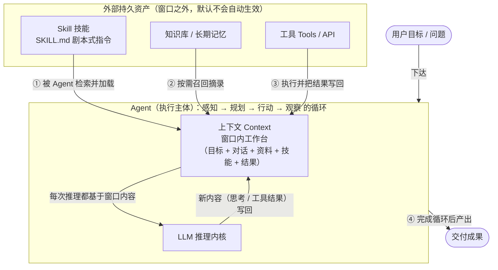
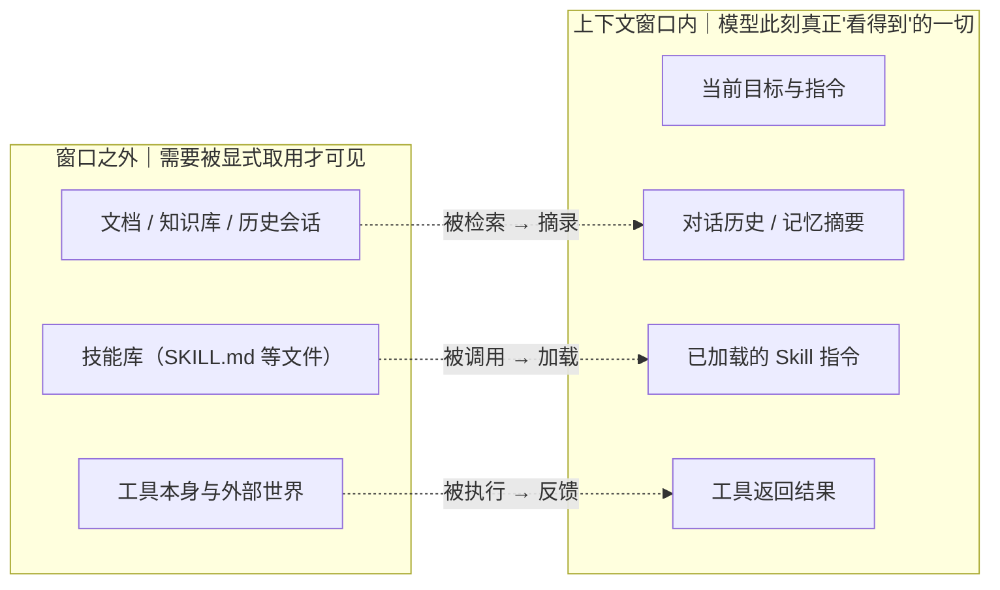
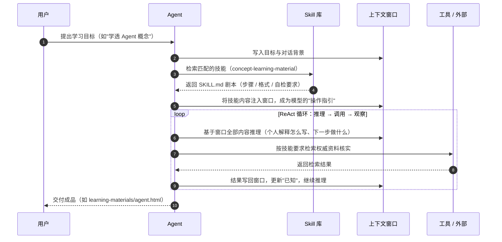

# Agent × 上下文 × Skill：三者关系说明

> **一句话总结：Agent 是「执行者」，上下文（Context）是「工作台」，Skill 是「操作手册」。**
> Skill 平时安静地存放在窗口之外，只有被 Agent 调用并加载进上下文之后，才能真正影响大模型的推理与行动。

---

## 0. 先各自认识三位主角

| 维度 | Agent（智能体） | 上下文 Context | Skill（技能） |
|---|---|---|---|
| 本质 | **执行主体**："谁在做" | **工作台**："此刻知道什么" | **能力资产**："知道怎么做" |
| 形态 | 编排循环（规划→行动→观察）+ LLM 内核 + 工具接口 | 上下文窗口内的 token 序列（随对话流动） | 结构化指令文件（SKILL.md），常驻磁盘 |
| 生命周期 | 任务运行期间存在，任务结束即结束 | 会话/单次运行内有效，可滚动淘汰 | **长期持久**，按需被加载 |
| 主动性 | **主动**：做规划、下决策、调工具 | 被动：被写入、被读取 | 被动：等待被检索和调用 |
| 对模型是否默认可见 | 否（它是运行框架，不是文本） | **是**（模型只能看到窗口内的内容） | 否（不注入窗口就"看不见"） |
| 生活类比 | 员工 | 办公桌台面 | 锁在抽屉里的 SOP 手册 |

三者不是并列关系，而是**嵌套协作关系**：Skill 是静态资产，Context 是动态舞台，Agent 是把两者串起来并驱动 LLM 行动的编排者。

---

## 1. 结构关系：一次任务中三者如何各就各位

**图 1 解读**：图中央的 `Agent` 是一个运行中的闭环——它不断在「窗口内工作台（上下文）」与「LLM 推理内核」之间读写。而 Skill、知识库、工具都属于**窗口之外的持久资产**，它们不会自己起作用：任何一条要进入模型视野的信息，都必须先由 Agent 显式取用并放入上下文。这正是三者关系中最关键的一点——**Skill 对模型的影响是间接的，中间隔着「加载进上下文」这一步**。

---

## 2. 边界关系：窗口内 vs 窗口外

**图 2 解读**：上下文窗口就是「注意力边界」——LLM 每做一次推理，只能基于窗口内的 token。窗口**容量有限**（上下文长度上限），所以窗口内的每一项都占用空间；这迫使 Agent 做**上下文管理**：目标、历史、已加载技能、工具结果挤在同一块"桌面"上，装不下的只能截断、摘要或淘汰。Skill 恰恰是缓解这一矛盾的设计：它**平时不占窗口空间**，只在需要时才被加载。

---

## 3. 时序关系：一次任务中 Skill 如何「进入」上下文

**图 3 解读**：把本仓库的实际工作流代入看一遍——用户向 Agent 提出概念学习请求；Agent 先找到并读取 `SKILL.md`，把其中的「五段结构 + 检索核实 + 自检清单」注入上下文；此后模型的每一次推理都被这段技能指令"框定"；检索到的资料也写回上下文持续供能；循环结束产出成品。可见：

- **Skill 决定 Agent 的行为方式**（怎么做、按什么结构输出）；
- **上下文决定 Agent 当前的认知**（此刻知道什么、还缺什么）；
- **Agent 决定节奏与取舍**（何时加载技能、何时检索、何时收尾）。

---

## 4. 常见误区

1. **"Skill 会被模型自动记住并一直生效"** ❌
   模型只有上下文窗口内的"短期记忆"。Skill 若不注入上下文，模型就"看不见"它；即使本次注入了，任务结束后窗口清空，下次仍需重新加载。

2. **"上下文越大越好，塞得越多越聪明"** ❌
   窗口有硬上限，且研究（如 *Lost in the Middle*）表明长上下文中间部分容易被忽略。所以 Skill 要精简、按需加载，而不是把所有内容一次性堆进窗口。

3. **"Agent 就是会对话的 LLM"** ❌
   单纯的多轮对话没有外部循环。Agent 需要编排循环 + 工具调用 + 上下文管理 + 记忆策略，LLM 只是它的推理内核。

4. **"Skill 就是一段普通 Prompt"** ❌
   单次 Prompt 用完即弃；Skill 是**结构化、可复用、带元数据与自检规范**的技能包（YAML 声明触发场景、规定步骤与输出结构、内置质量检查）。二者本质都是文本指令，但 Skill 是"工程化封装后的 SOP"。

5. **"Skill 与工具 / MCP 是一回事"** ❌
   工具（Tools/MCP）是 Agent **对外行动**的接口（查资料、算数、操作文件）；Skill 是 Agent **对内知道怎么做**的指导文本。Skill 里可以*描述如何使用*工具，但它本身不是工具。

---

## 5. 结论与阅读顺序

- 想理解**单个概念** → 打开 `learning-materials/` 下对应的 HTML（agent / llm-context / skill 三份，均含个人解释、核心机制、应用场景、边界辨析、来源链接）。
- 想理解**三者怎么协作** → 本文档三张图依次看：图 1 看结构、图 2 看边界、图 3 看时序。
- 想理解**驱动这一切的 Skill 本身** → 阅读 `.workbuddy/skills/concept-learning-skill/SKILL.md`，本文所有示例（五段结构、检索核实、自检清单）都来自它的规定。

> 收束为一句话：**Skill 是剧本（常驻、按需取用），上下文是舞台（易失、容量有限），Agent 是演员兼导演（唯一主动的一方）——剧本只有被摆上舞台，演员的演出才会被它塑造。**
